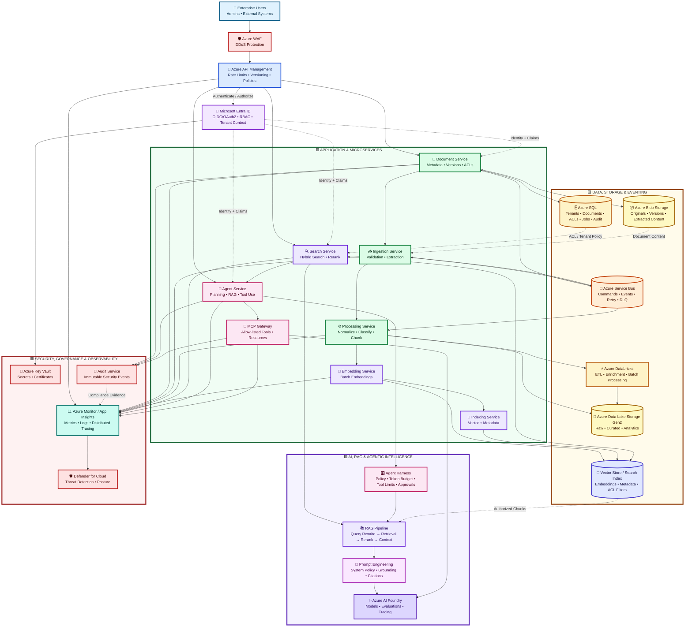

# 🏗️ HLD, Data Model, API, Capacity & Monitoring
  

## High-Level Architecture

> **Visual legend:** 🟦 Edge & Identity · 🟩 Application Services · 🟨 Data & Messaging · 🟪 AI/RAG · 🟥 Security & Observability  
> The diagram uses high-contrast fills and dark borders so the architecture remains readable in both light and dark GitHub themes.



### End-to-End Request & Document Flow

The following flows use **high-contrast colored boxes** so each stage is visually distinct and easy to follow on GitHub.

```mermaid
flowchart LR
    subgraph UPLOAD["📥 DOCUMENT UPLOAD & INGESTION"]
        direction LR
        U1["👤 Client"]:::blue --> U2["🛡️ WAF / APIM"]:::blue --> U3["🔐 Entra ID<br/>Authenticate + Authorize"]:::purple --> U4["📄 Document Service"]:::green
        U4 --> U5["📦 Blob Storage<br/>Original Document"]:::yellow
        U4 --> U6["🗄️ SQL<br/>Metadata + ACL"]:::yellow
        U4 --> U7["📨 Service Bus"]:::orange --> U8["📥 Ingestion"]:::green --> U9["⚙️ Processing<br/>Extract + Normalize + Chunk"]:::green --> U10["🧬 Embedding"]:::pink --> U11["🧠 Vector Index"]:::indigo
    end

    subgraph SEARCH["🔎 SEARCH & RAG"]
        direction LR
        S1["👤 User Query"]:::blue --> S2["🚪 APIM"]:::blue --> S3["🔐 Entra ID<br/>Tenant + Claims"]:::purple --> S4["🔍 Search Service"]:::green --> S5["🔒 ACL / Tenant Filter"]:::red --> S6["⚡ Hybrid Retrieval<br/>Keyword + Vector"]:::indigo --> S7["🎯 Reranking"]:::pink --> S8["📚 RAG Context<br/>Authorized Sources"]:::violet --> S9["📝 Prompt Policy<br/>Grounding + Citations"]:::violet --> S10["✨ Azure AI Foundry<br/>LLM"]:::purple --> S11["📑 Grounded Response<br/>Citations"]:::green
    end

    subgraph AGENT["🤖 AGENTIC AI + MCP"]
        direction LR
        A1["👤 User Request"]:::blue --> A2["🤖 Agent Service"]:::green --> A3["🎛️ Agent Harness<br/>Policy + Budget + Limits"]:::red
        A3 --> A4["📚 RAG Pipeline"]:::violet
        A3 --> A5["🔌 MCP Gateway<br/>Allow-listed Tools"]:::orange --> A6["🔧 Enterprise Tools / APIs"]:::yellow
        A4 --> A7["✨ Azure AI Foundry"]:::purple
        A5 --> A7
        A6 --> A7 --> A8["✅ Grounded Answer"]:::green --> A9["🧾 Audit + Telemetry"]:::red
    end

    subgraph SECURITY["🔴 CRITICAL SECURITY BOUNDARY"]
        direction TB
        SEC1["🔐 Authenticate"]:::red --> SEC2["🏢 Resolve Tenant"]:::red --> SEC3["👮 Evaluate RBAC / ACL"]:::red --> SEC4["🚫 Remove Unauthorized Content"]:::red --> SEC5["🧠 Only Authorized Context → Model"]:::red
    end

    U11 -. "Indexed Knowledge" .-> S6
    S5 -. "Authorization Policy" .-> SEC3
    S8 -. "Authorized Context" .-> SEC5
    A3 -. "Policy Enforcement" .-> SEC3
    A9 -. "Compliance Evidence" .-> SEC5

    classDef blue fill:#DBEAFE,stroke:#1D4ED8,stroke-width:3px,color:#172554;
    classDef green fill:#DCFCE7,stroke:#15803D,stroke-width:3px,color:#052E16;
    classDef yellow fill:#FEF3C7,stroke:#B45309,stroke-width:3px,color:#451A03;
    classDef orange fill:#FFEDD5,stroke:#C2410C,stroke-width:3px,color:#431407;
    classDef purple fill:#EDE9FE,stroke:#7E22CE,stroke-width:3px,color:#3B0764;
    classDef violet fill:#F5D0FE,stroke:#A21CAF,stroke-width:3px,color:#4A044E;
    classDef pink fill:#FCE7F3,stroke:#BE185D,stroke-width:3px,color:#500724;
    classDef indigo fill:#E0E7FF,stroke:#4338CA,stroke-width:3px,color:#1E1B4B;
    classDef red fill:#FEE2E2,stroke:#B91C1C,stroke-width:4px,color:#450A0A;

    style UPLOAD fill:#F0FDF4,stroke:#166534,stroke-width:4px
    style SEARCH fill:#EEF2FF,stroke:#3730A3,stroke-width:4px
    style AGENT fill:#FDF2F8,stroke:#9D174D,stroke-width:4px
    style SECURITY fill:#FEF2F2,stroke:#991B1B,stroke-width:5px
```



#### 🔐 Security Enforcement Point

> **Important:** Authentication, tenant resolution, RBAC/ACL evaluation and unauthorized-content filtering happen **before retrieved content is placed into the LLM context**.

**Upload:** Client → WAF/APIM → Entra ID → Document Service → Blob/SQL → Service Bus → Ingestion → Processing → Embedding → Vector Index.

**Search / RAG:** Client → APIM → Entra ID → Search → ACL Filter → Hybrid Retrieval → Reranking → Authorized RAG Context → Prompt Policy → Azure AI Foundry → Cited Response.

**Agentic:** Client → Agent Service → Agent Harness → RAG and/or MCP Gateway → Allow-listed Tools → Azure AI Foundry → Grounded Response → Audit/Telemetry.


## Service Boundaries
| Service | Responsibility |
|---|---|
| DocumentService | metadata, versions, ACLs, upload orchestration |
| IngestionService | async validation and content extraction |
| ProcessingService | normalization, classification and chunking |
| EmbeddingService | batch embedding generation |
| IndexingService | vector and metadata indexing |
| SearchService | authorization-aware hybrid retrieval |
| AgentService | planning, RAG orchestration and tool use |
| McpGateway | authenticated allow-listed tools/resources |
| AuditService | immutable security and audit events |

## Data Model
```text
Tenant 1---* User
Tenant 1---* Document
Document 1---* DocumentVersion
DocumentVersion 1---* Chunk
Chunk 1---1 VectorRecord
Document 1---* DocumentAcl
DocumentVersion 1---* ProcessingJob
Tenant 1---* AuditEvent
```

Core SQL tables: Tenant, User, Document, DocumentVersion, DocumentAcl, Chunk, ProcessingJob, OutboxMessage, AuditEvent.

Recommended indexes: `(TenantId, Id)`, `(TenantId, CreatedAt)`, `(DocumentId, VersionNumber)`, `(DocumentId, PrincipalId)`, and job state/lease indexes.

## API Design
```text
POST   /api/v1/documents
GET    /api/v1/documents/{id}
POST   /api/v1/documents/{id}/versions
DELETE /api/v1/documents/{id}
POST   /api/v1/search
POST   /api/v1/agents/runs
GET    /api/v1/agents/runs/{id}
GET    /health/live
GET    /health/ready
```

Every command accepts an idempotency key. APIs return Problem Details for errors and propagate correlation IDs.

## RAG Pipeline
1. Authenticate user.
2. Resolve tenant and authorization context.
3. Apply ACL/security metadata filters.
4. Embed query.
5. Run vector + keyword retrieval.
6. Rerank authorized candidates.
7. Build bounded context with source citations.
8. Apply prompt policy.
9. Invoke model.
10. Validate grounding/citations and return response.

## Agent Harness
AgentPolicy controls allowed tools, maximum tool calls, token budget, timeout, data classifications and approval requirements. The harness records every tool invocation and refuses tools outside policy.

## MCP
MCP Gateway exposes narrowly scoped tools/resources. Validate authentication, tenant, authorization, JSON schema, rate limits, input size, downstream timeout and audit events before execution.

## Capacity Estimation
Example starting point: 10,000 documents/day, 50 MB average/document, 500k chunks/day, 100 search RPS peak.

Scale independently: API replicas from CPU/RPS; workers from Service Bus queue age; embedding workers from model throughput; search from latency/RPS; agent workers from concurrent runs and token rate limits.

Use Little's Law for queue sizing: `L = λW`. Track queue age and drain rate rather than only CPU.

## Monitoring
Platform metrics: request rate, p50/p95/p99 latency, 4xx/5xx, queue depth, oldest message age, DLQ count, DB DTU/CPU, storage errors.

AI metrics: retrieval hit rate, Recall@K, MRR/NDCG, groundedness, citation coverage, refusal accuracy, prompt-injection detection, tokens/request and cost/request.

Tracing must cross HTTP, Service Bus, SQL, vector search, model calls and MCP tool calls.